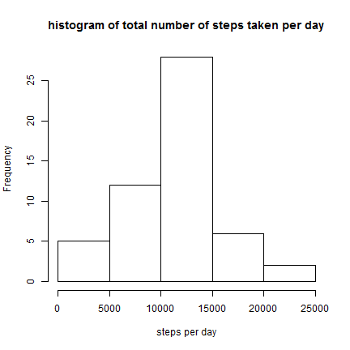
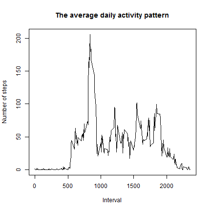
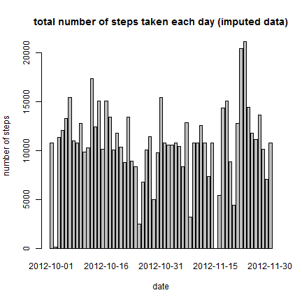
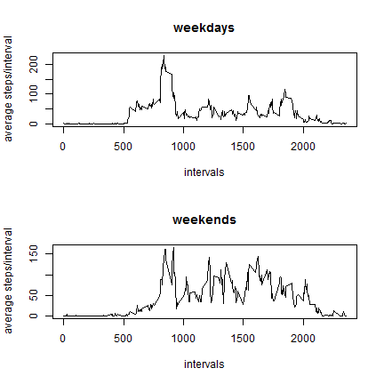

#Analyze data collected from a personal activity monitoring device

**Next steps for detail:**

1. Loading and preprocessing the data
2. What is mean total number of steps taken per day?
3. What is the average daily activity pattern?
4. Imputing missing values
5. Are there differences in activity patterns between weekdays and weekends?


##Step 0: Preparing the environment

Load required packages, set work directory, set EN locale for weekdays and global options for "Knitr":


```r
##  Load required packages
library(knitr)
library(lattice)

##  Save old work directory and set work directory '/Reproducible_research/RepData_PeerAssessment1'
old_wd <- getwd()
if (length(grep("RepData_PeerAssessment1", old_wd)) == 0){
        setwd(normalizePath(paste0(old_wd, "/Reproducible_research/RepData_PeerAssessment1"), winslash = "\\"))
}
Sys.setlocale("LC_ALL", "English")
```

```
## [1] "LC_COLLATE=English_United States.1252;LC_CTYPE=English_United States.1252;LC_MONETARY=English_United States.1252;LC_NUMERIC=C;LC_TIME=English_United States.1252"
```


```r
##  global setup options for knitr
opts_chunk$set(results="hide",fig.width = 6,fig.height = 6)
```


##Step 1: Loading and Preprocessing the data


```r
##  extract ZIP and load CSV
if(!file.exists("activity.csv")) {
        message('unzip activity.zip...')
        unzip("activity.zip")
}
raw_data <- read.csv("activity.csv", header = TRUE)
clear_data <- na.omit(raw_data)
```

##Step 2: Calculating the number of Steps taken per day


```r
##  stepsPerDay
stepsPerDay <- aggregate(clear_data$steps, list(clear_data$date),sum, na.rm = TRUE)
colnames(stepsPerDay) <- c('date','num_steps')
```


###Step 2a: Plot a histogram of the total number of steps taken per day


```r
## plotting histogram
hist(stepsPerDay$num_steps,
     xlab = 'steps per day',
     main = 'histogram of total number of steps taken per day')
```

 

###Step 2b: Calculate the mean and median of the total number of steps taken per day


```r
##  mean and median of steps taken per day
median_StepsPerDay  <- median(stepsPerDay$num_steps, na.rm = TRUE)
mean_StepsPerDay  <- mean(stepsPerDay$num_steps, na.rm = TRUE)
```

The mean of total number of steps per day is **10766.19**  
The median of total number of steps per day is **10765**

##Step 3: Average daily activity pattern

###Step 3a: Time series plot of the 5-minute interval (x-axis) and the average number of steps taken, averaged across all days (y-axis)


```r
##  average number of steps taken
avg_StepsInterval <- aggregate(clear_data$steps, list(clear_data$interval), mean, na.rm = TRUE)
colnames(avg_StepsInterval) <- c('interval', 'num_steps')
plot(avg_StepsInterval$interval, avg_StepsInterval$num_steps,
     type = 'l',
     xlab = 'Interval',
     ylab = 'Number of steps',
     main = 'The average daily activity pattern') 
```

 

###Step 3b: Which 5-minute interval, on average across all the days in the dataset, contains the maximum number of steps?


```r
##  maximum number of steps in the interval
max_StepsInterval <- avg_StepsInterval$interval[which.max(avg_StepsInterval$num_steps)]
```

The 5-minute interval, on average across all days, that contains the maximum number of steps is **835**

##Step 4: Imputing missing values

###Step 4a: Calculate the total number of missing values in the dataset


```r
##  number of rows with NA values
num_rowsNA <- sum(!complete.cases(raw_data))
```

The total number of missing values in the dataset is **2304**

###Step 4b: Devise a strategy for filling in all of the missing values in the dataset. The strategy does not need to be sophisticated. For example, you could use the mean/median for that day, or the mean for that 5-minute interval, etc. Create a new dataset that is equal to the original dataset but with the missing data filled in.


```r
##  substituting the number of steps columns with NA values with average number of steps for the given interval
new_stepsPerDay <- merge(raw_data,avg_StepsInterval, by = 'interval' ) 
new_stepsPerDay$steps[is.na(new_stepsPerDay$steps)] <- new_stepsPerDay$num_steps[is.na(new_stepsPerDay$steps)]
new_stepsPerDay <- new_stepsPerDay[,c(1:3)]
```

###Step 4c: Make a histogram of the total number of steps taken each day


```r
##  sum of steps across different dates
total_stepsPerDay <- aggregate(new_stepsPerDay$steps,list(new_stepsPerDay$date),sum, na.rm = TRUE)
colnames(total_stepsPerDay) <- c('date','num_steps')

##  Plotting the histogram
barplot(total_stepsPerDay$num_steps,
        names.arg = total_stepsPerDay$date,
        main = 'total number of steps taken each day (imputed data)',
        xlab = 'date',
        ylab = 'number of steps')
```

 

###Step 4d: Calculate mean and median total number of steps taken per day


```r
##  mean and median of steps taken per day (imputed)
mean_total_stepsPerDay <- mean(total_stepsPerDay$num_steps)
median_total_stepsPerDay <- median(total_stepsPerDay$num_steps)
```

The mean of total number steps per day is **10766.19**  
The median of total number steps per day is **10766.19**

##Step 5: Are there differences in activity patterns between weekdays and weekends?

###Step 5a: Create a new factor variable in the dataset with two levels <U+0432><U+0402>“ <U+0432><U+0402><U+045A>weekday<U+0432><U+0402><U+045C> and <U+0432><U+0402><U+045A>weekend<U+0432><U+0402><U+045C> indicating whether a given date is a weekday or weekend day


```r
##  weekday/weekend
new_stepsPerDay$date <- as.Date(new_stepsPerDay$date,format = '%Y-%m-%d')
new_stepsPerDay$day <- ifelse(weekdays(new_stepsPerDay$date) %in% c('Saturday','Sunday'), 'weekend', 'weekday')
```

###Step 5b: Make a panel plot containing a time series plot of the 5-minute interval and the average number of steps taken, averaged across all weekday days or weekend days


```r
## make a panel time series plot
panel_weekday <- aggregate(steps ~ interval, data = new_stepsPerDay[new_stepsPerDay$day=="weekday",],mean)
panel_weekend <- aggregate(steps ~ interval, data = new_stepsPerDay[new_stepsPerDay$day=="weekend",],mean)

par(mfrow = c(2,1))
plot(panel_weekday,
     type = "l",
     xlab = "intervals",
     ylab = "average steps/interval",
     main = "weekdays")
plot(panel_weekend,
     type = "l",
     xlab = "intervals",
     ylab = "average steps/interval",
     main = "weekends")
```

 


